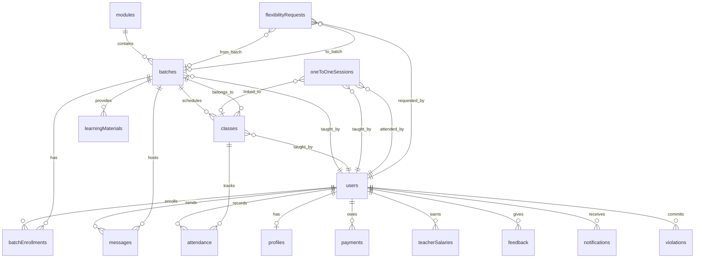

# Design Document: EMTEES Academy LMS

## Overview

The EMTEES Academy LMS is a comprehensive learning management system built on an existing full-stack architecture (PostgreSQL + Drizzle ORM, tRPC + Hono, React + TanStack Query + shadcn/ui). The system manages WhatsApp-style group learning through a hierarchical Module → Batch structure, supports live video classes (both group and one-to-one), automates attendance tracking via chat activity, handles fee management with automatic access restrictions, and provides detailed analytics for academic performance monitoring.

### Key Design Principles

1. **Leverage Existing Infrastructure**: Build upon the scaffolded schema, routers, and middleware already in place
2. **Role-Based Access Control**: Enforce strict permissions using existing middleware (publicQuery, authedQuery, adminQuery, teacherQuery)
3. **Automated Business Logic**: Implement engines for attendance, payments, salary, and notifications to reduce manual overhead
4. **Data Privacy**: Never expose sensitive information (phone numbers, passwords) in API responses
5. **Single Device Enforcement**: Maintain session integrity by allowing only one active device per user
6. **Audit Trail**: Track all state changes with timestamps and actor IDs for compliance

### System Context

The system operates within these boundaries:
- **Users**: Super_Admin, Admin, Academic_Head, Teacher, Student
- **Learning Structure**: Module (course group) → Batch (sub-group) → Enrollment (student membership)
- **Communication**: Group chat per Batch, no direct student-to-student messaging
- **Classes**: Group live sessions and private one-to-one sessions
- **Financial**: Fee tracking, payment recording, automatic access restrictions
- **Analytics**: Performance metrics, leaderboards, reports

---

## Architecture

### High-Level Architecture

```
┌─────────────────────────────────────────────────────────────┐
│                     Client Layer                             │
│  ┌──────────────────┐         ┌──────────────────┐         │
│  │   React Web      │         │   Mobile App     │         │
│  │   (Admin Panel)  │         │   (Student/      │         │
│  │                  │         │    Teacher)      │         │
│  └────────┬─────────┘         └────────┬─────────┘         │
│           │                            │                    │
│           └────────────┬───────────────┘                    │
└────────────────────────┼────────────────────────────────────┘
                         │
                         │ tRPC over HTTP
                         │
┌────────────────────────┼────────────────────────────────────┐
│                  API Layer (Hono + tRPC)                     │
│  ┌───────────────────────────────────────────────────────┐  │
│  │              Router Layer                             │  │
│  │  auth │ user │ learning │ class │ admin │ student    │  │
│  └───────────────────┬───────────────────────────────────┘  │
│                      │                                       │
│  ┌───────────────────┴───────────────────────────────────┐  │
│  │           Middleware Layer                            │  │
│  │  publicQuery │ authedQuery │ adminQuery │ teacherQuery│  │
│  └───────────────────┬───────────────────────────────────┘  │
│                      │                                       │
│  ┌───────────────────┴───────────────────────────────────┐  │
│  │              Business Logic Engines                   │  │
│  │  Attendance │ Payment │ Salary │ Notification         │  │
│  └───────────────────┬───────────────────────────────────┘  │
└────────────────────────┼────────────────────────────────────┘
                         │
                         │ Drizzle ORM
                         │
┌────────────────────────┼────────────────────────────────────┐
│                  Data Layer (PostgreSQL)                     │
│  ┌───────────────────────────────────────────────────────┐  │
│  │  users │ profiles │ modules │ batches │ enrollments  │  │
│  │  messages │ classes │ attendance │ payments │ ...    │  │
│  └───────────────────────────────────────────────────────┘  │
└──────────────────────────────────────────────────────────────┘
```

### Technology Stack

- **Frontend**: React 18, React Router, TanStack Query, shadcn/ui components
- **Backend**: Hono (HTTP server), tRPC (type-safe API), Node.js
- **Database**: PostgreSQL 14+
- **ORM**: Drizzle ORM (pg-core)
- **Authentication**: JWT (jose library), bcrypt for password hashing
- **Real-time**: Polling-based updates (TanStack Query refetch intervals)
- **File Storage**: External service (URLs stored in database)
- **Video**: External video service integration (meeting URLs stored)

### Data Flow Patterns

1. **Authentication Flow**:
   - Client → auth.login/register → JWT generation → Client stores token → Subsequent requests include token in header → Middleware validates JWT → Context populated with user

2. **Message Flow**:
   - Student sends message → learning.sendMessage → Validate enrollment → Store message → Notification engine triggers → Other clients poll and fetch new messages

3. **Attendance Flow**:
   - Class ends → Teacher records attendance → Attendance engine calculates status from chat count → Store attendance record → If 7 consecutive absences → Notification engine alerts

4. **Payment Flow**:
   - Admin creates payment → Payment record stored → Due date approaches → Notification engine sends reminder → Due date passes → Payment engine marks overdue → Grace period elapses → Payment engine deactivates enrollments

---

## Components and Interfaces

### Core Components

#### 1. Authentication Service
**Responsibility**: User authentication, session management, device token enforcement

**Interfaces**:
```typescript
interface AuthService {
  register(input: RegisterInput): Promise<AuthResponse>
  login(input: LoginInput): Promise<AuthResponse>
  sendOtp(phone: string): Promise<OtpResponse>
  verifyOtp(phone: string, code: string, deviceToken?: string): Promise<AuthResponse>
  me(userId: number): Promise<UserProfile | null>
}

interface RegisterInput {
  name: string
  phone: string
  username: string
  password: string
  role: Role
}

interface LoginInput {
  username: string
  password: string
  deviceToken?: string
}

interface AuthResponse {
  token: string
  user: {
    id: number
    name: string
    role: Role
    phone: string
  }
}
```

**Dependencies**: users table, otpCodes table, JWT library, bcrypt

---

#### 2. User Management Service
**Responsibility**: CRUD operations for users, profile management, bulk import

**Interfaces**:
```typescript
interface UserService {
  list(filters: UserFilters): Promise<User[]>
  getById(id: number): Promise<User>
  create(input: CreateUserInput): Promise<User>
  update(id: number, input: UpdateUserInput): Promise<User>
  delete(id: number): Promise<void>
  importStudents(students: StudentImportInput[]): Promise<ImportResult>
  myProfile(userId: number): Promise<UserProfile>
  myBatches(userId: number): Promise<BatchEnrollment[]>
}

interface UserFilters {
  role?: Role | 'all'
  search?: string
  status?: Status | 'all'
  limit?: number
  offset?: number
}

interface CreateUserInput {
  name: string
  phone: string
  email?: string
  username: string
  password: string
  role: Role
  course?: string
  batch?: string
  feesTotal?: number
}
```

**Dependencies**: users table, profiles table, batchEnrollments table

---

#### 3. Learning Management Service
**Responsibility**: Module/Batch CRUD, enrollment management, learning materials

**Interfaces**:
```typescript
interface LearningService {
  // Modules
  listModules(): Promise<Module[]>
  createModule(input: CreateModuleInput): Promise<Module>
  
  // Batches
  listBatches(moduleId?: number): Promise<Batch[]>
  createBatch(input: CreateBatchInput): Promise<Batch>
  enrollStudent(batchId: number, studentId: number): Promise<void>
  removeStudent(batchId: number, studentId: number): Promise<void>
  
  // Materials
  listMaterials(batchId: number): Promise<LearningMaterial[]>
  createMaterial(input: CreateMaterialInput): Promise<LearningMaterial>
}

interface CreateModuleInput {
  name: string
  description?: string
  maxStudents?: number
  minStudents?: number
}

interface CreateBatchInput {
  moduleId: number
  name: string
  timeSlot?: string
  teacherId?: number
  maxStudents?: number
}
```

**Dependencies**: modules table, batches table, batchEnrollments table, learningMaterials table

---

#### 4. Messaging Service
**Responsibility**: Group chat messages, reactions, replies, access control

**Interfaces**:
```typescript
interface MessagingService {
  listMessages(batchId: number, userId: number, pagination: Pagination): Promise<Message[]>
  sendMessage(input: SendMessageInput, userId: number): Promise<Message>
  addReaction(messageId: number, userId: number, emoji: string): Promise<void>
}

interface SendMessageInput {
  batchId: number
  content: string
  type: MessageType
  mediaUrl?: string
  replyToId?: number
  isAnnouncement?: boolean
}

interface Pagination {
  limit: number
  offset: number
}
```

**Dependencies**: messages table, batchEnrollments table (for access control)

---

#### 5. Class Management Service
**Responsibility**: Live class scheduling, start/end, one-to-one sessions

**Interfaces**:
```typescript
interface ClassService {
  // Group Classes
  list(filters: ClassFilters, userId: number, userRole: Role): Promise<Class[]>
  create(input: CreateClassInput, teacherId: number): Promise<Class>
  start(classId: number, teacherId: number): Promise<void>
  end(classId: number, teacherId: number): Promise<void>
  
  // One-to-One Sessions
  listOneToOne(filters: OneToOneFilters, userId: number, userRole: Role): Promise<OneToOneSession[]>
  createOneToOne(input: CreateOneToOneInput): Promise<OneToOneSession>
}

interface CreateClassInput {
  batchId: number
  title: string
  description?: string
  classType: 'group' | 'one_to_one'
  scheduledAt: Date
  meetingUrl?: string
}

interface CreateOneToOneInput {
  teacherId: number
  studentId: number
  sessionLength: 30 | 45
  scheduledAt: Date
}
```

**Dependencies**: classes table, oneToOneSessions table, batches table

---

#### 6. Attendance Engine
**Responsibility**: Auto-calculate attendance from chat activity, track streaks, trigger alerts

**Interfaces**:
```typescript
interface AttendanceEngine {
  recordAttendance(classId: number, studentId: number, chatCount: number): Promise<AttendanceStatus>
  getAttendance(classId: number): Promise<Attendance[]>
  myAttendance(studentId: number): Promise<Attendance[]>
  checkAbsenceStreak(studentId: number): Promise<number>
  calculateAttendancePercentage(studentId: number): Promise<number>
}

type AttendanceStatus = 'present' | 'absent' | 'late'
```

**Logic**:
- chatCount >= 4 → status = 'present'
- chatCount < 4 → status = 'absent'
- After recording, check if student has 7 consecutive absences → trigger notification

**Dependencies**: attendance table, classes table, Notification Engine

---

#### 7. Payment Engine
**Responsibility**: Fee tracking, payment recording, overdue detection, access restriction

**Interfaces**:
```typescript
interface PaymentEngine {
  listPayments(filters: PaymentFilters): Promise<Payment[]>
  createPayment(input: CreatePaymentInput): Promise<Payment>
  recordPayment(paymentId: number, amount: number, transactionId?: string): Promise<void>
  checkOverduePayments(): Promise<void>
  restrictAccess(studentId: number): Promise<void>
  restoreAccess(studentId: number): Promise<void>
}

interface CreatePaymentInput {
  studentId: number
  amount: number
  type: string
  dueDate?: Date
  notes?: string
}
```

**Logic**:
- 3 days before due date → send reminder
- On due date → mark overdue, send notification
- 7 days after due date → deactivate enrollments, restrict access
- On payment → reactivate enrollments

**Dependencies**: payments table, batchEnrollments table, Notification Engine

---

#### 8. Salary Engine
**Responsibility**: Auto-calculate teacher salaries from class counts

**Interfaces**:
```typescript
interface SalaryEngine {
  listSalaries(filters: SalaryFilters): Promise<TeacherSalary[]>
  calculateSalary(input: CalculateSalaryInput): Promise<TeacherSalary>
}

interface CalculateSalaryInput {
  teacherId: number
  month: string // 'YYYY-MM'
  groupClassRate: number
  oneToOneRate: number
}
```

**Logic**:
- Count completed group classes for teacher in month
- Count completed one-to-one sessions for teacher in month
- Total = (groupCount × groupRate) + (oneToOneCount × oneToOneRate)

**Dependencies**: classes table, oneToOneSessions table, teacherSalaries table

---

#### 9. Notification Engine
**Responsibility**: Dispatch in-app and push notifications based on system events

**Interfaces**:
```typescript
interface NotificationEngine {
  sendClassReminder(classId: number): Promise<void>
  sendFeeReminder(studentId: number, paymentId: number): Promise<void>
  sendOverdueNotification(studentId: number, paymentId: number): Promise<void>
  sendAbsenceAlert(studentId: number, teacherId: number): Promise<void>
  sendFlexibilityRequestUpdate(requestId: number, status: string): Promise<void>
  sendBroadcast(userId: number, title: string, message: string, type: string): Promise<void>
}
```

**Triggers**:
- 10 minutes before class → sendClassReminder
- 3 days before due date → sendFeeReminder
- On overdue → sendOverdueNotification
- 7 consecutive absences → sendAbsenceAlert
- Flexibility request resolved → sendFlexibilityRequestUpdate

**Dependencies**: notifications table, users table, classes table, payments table

---

#### 10. Flexibility Service
**Responsibility**: Handle hold, rejoin, batch change requests

**Interfaces**:
```typescript
interface FlexibilityService {
  createRequest(input: CreateRequestInput, studentId: number): Promise<FlexibilityRequest>
  listRequests(filters: RequestFilters): Promise<FlexibilityRequest[]>
  resolveRequest(requestId: number, status: 'approved' | 'rejected', note?: string, adminId: number): Promise<void>
  myRequests(studentId: number): Promise<FlexibilityRequest[]>
}

interface CreateRequestInput {
  requestType: 'hold' | 'rejoin' | 'batch_change'
  fromBatchId?: number
  toBatchId?: number
  reason?: string
}
```

**Logic**:
- On approve 'hold' → set enrollment status to 'on_hold'
- On approve 'rejoin' → set enrollment status to 'active'
- On approve 'batch_change' → deactivate old enrollment, create new enrollment

**Dependencies**: flexibilityRequests table, batchEnrollments table, Notification Engine

---

#### 11. Analytics Service
**Responsibility**: Generate reports, calculate performance metrics, leaderboards

**Interfaces**:
```typescript
interface AnalyticsService {
  getDashboardStats(): Promise<DashboardStats>
  getStudentReport(studentId: number): Promise<StudentReport>
  getTeacherReport(teacherId: number): Promise<TeacherReport>
  getLeaderboard(): Promise<LeaderboardEntry[]>
  exportReport(reportType: string, format: 'pdf' | 'excel'): Promise<Buffer>
}

interface DashboardStats {
  totalStudents: number
  totalTeachers: number
  totalBatches: number
  totalClasses: number
  pendingFees: number
}

interface StudentReport {
  attendance: {
    total: number
    present: number
    percentage: number
  }
  payments: Payment[]
  profile: Profile
}

interface TeacherReport {
  totalClasses: number
  studentEngagementRate: number
  studentRetentionRate: number
  courseCompletionRate: number
}
```

**Dependencies**: All tables for aggregation queries

---

#### 12. Feedback Service
**Responsibility**: Collect and manage student feedback on teachers

**Interfaces**:
```typescript
interface FeedbackService {
  submitFeedback(input: SubmitFeedbackInput, studentId: number): Promise<void>
  listFeedback(): Promise<Feedback[]>
}

interface SubmitFeedbackInput {
  teacherId: number
  classId?: number
  rating: number // 1-5
  comment?: string
}
```

**Dependencies**: feedback table

---

#### 13. Discipline Service
**Responsibility**: Log and manage rule violations

**Interfaces**:
```typescript
interface DisciplineService {
  listViolations(): Promise<Violation[]>
  createViolation(input: CreateViolationInput, reporterId: number): Promise<void>
  suspendUser(userId: number): Promise<void>
}

interface CreateViolationInput {
  userId: number
  type: string
  description: string
  action?: string
}
```

**Dependencies**: violations table, users table, Notification Engine

---

## Data Models

### Entity Relationship Overview



### Key Entities

#### User
```typescript
interface User {
  id: number
  unionId: string // unique identifier
  username: string | null
  password: string | null // bcrypt hash
  name: string
  email: string | null
  phone: string | null
  role: 'super_admin' | 'admin' | 'academic_head' | 'teacher' | 'student'
  status: 'active' | 'inactive' | 'suspended' | 'on_hold'
  avatar: string | null
  deviceToken: string | null // for single-device enforcement
  lastLoginAt: Date | null
  createdAt: Date
  updatedAt: Date
}
```

**Indexes**: username (unique), phone, role

**Constraints**:
- username must be unique if provided
- phone must be unique if provided
- password must be bcrypt hash with cost >= 10

---

#### Profile
```typescript
interface Profile {
  id: number
  userId: number // FK to users
  course: string | null
  batch: string | null
  batchTime: string | null
  feesTotal: Decimal
  feesPaid: Decimal
  feesBalance: Decimal // computed: feesTotal - feesPaid
  paymentStatus: 'paid' | 'partial' | 'unpaid' | 'overdue'
  admissionDate: Date
  completionDate: Date | null
  activityTimeline: JSON | null // array of timestamped events
  createdAt: Date
  updatedAt: Date
}
```

**Relationships**: One-to-one with User (cascade delete)

---

#### Module
```typescript
interface Module {
  id: number
  name: string
  description: string | null
  maxStudents: number // default 50
  minStudents: number // default 5
  status: string // 'active' | 'inactive'
  createdAt: Date
  updatedAt: Date
}
```

**Relationships**: One-to-many with Batch

---

#### Batch
```typescript
interface Batch {
  id: number
  moduleId: number // FK to modules
  name: string
  timeSlot: string | null
  teacherId: number | null // FK to users
  maxStudents: number // default 30
  status: string // 'active' | 'inactive'
  createdAt: Date
}
```

**Relationships**:
- Many-to-one with Module (cascade delete)
- Many-to-one with User (teacher)
- One-to-many with BatchEnrollment
- One-to-many with Message
- One-to-many with Class
- One-to-many with LearningMaterial

---

#### BatchEnrollment
```typescript
interface BatchEnrollment {
  id: number
  batchId: number // FK to batches
  studentId: number // FK to users
  joinedAt: Date
  leftAt: Date | null
  status: string // 'active' | 'inactive' | 'on_hold'
}
```

**Indexes**: Unique constraint on (batchId, studentId)

**Relationships**:
- Many-to-one with Batch (cascade delete)
- Many-to-one with User (cascade delete)

---

#### Message
```typescript
interface Message {
  id: number
  batchId: number // FK to batches
  senderId: number // FK to users
  type: 'text' | 'voice' | 'image' | 'video' | 'pdf'
  content: string
  mediaUrl: string | null
  replyToId: number | null // FK to messages (self-reference)
  reactions: JSON | null // { emoji: [userId, ...] }
  isAnnouncement: boolean // default false
  createdAt: Date
}
```

**Indexes**: batchId, senderId, createdAt

**Relationships**:
- Many-to-one with Batch (cascade delete)
- Many-to-one with User (cascade delete)

---

#### Class
```typescript
interface Class {
  id: number
  batchId: number // FK to batches
  teacherId: number // FK to users
  title: string
  description: string | null
  classType: 'group' | 'one_to_one'
  status: 'scheduled' | 'ongoing' | 'completed' | 'cancelled'
  scheduledAt: Date
  startedAt: Date | null
  endedAt: Date | null
  duration: number // minutes, default 0
  meetingUrl: string | null
  recordingUrl: string | null
  recordingDeletedAt: Date | null
  createdAt: Date
}
```

**Relationships**:
- Many-to-one with Batch (cascade delete)
- Many-to-one with User (teacher)
- One-to-many with Attendance

---

#### OneToOneSession
```typescript
interface OneToOneSession {
  id: number
  teacherId: number // FK to users
  studentId: number // FK to users
  classId: number | null // FK to classes
  sessionLength: number // 30 or 45 minutes
  scheduledAt: Date
  status: 'scheduled' | 'ongoing' | 'completed' | 'cancelled'
  validFrom: Date | null
  validUntil: Date | null // scheduledAt + 60 days
  completedAt: Date | null
  createdAt: Date
}
```

**Relationships**:
- Many-to-one with User (teacher)
- Many-to-one with User (student)
- Many-to-one with Class (optional)

---

#### Attendance
```typescript
interface Attendance {
  id: number
  classId: number // FK to classes
  studentId: number // FK to users
  chatCount: number // default 0
  status: 'present' | 'absent' | 'late'
  recordedAt: Date
}
```

**Indexes**: Unique constraint on (classId, studentId)

**Relationships**:
- Many-to-one with Class (cascade delete)
- Many-to-one with User (cascade delete)

---

#### Payment
```typescript
interface Payment {
  id: number
  studentId: number // FK to users
  amount: Decimal
  type: string // 'tuition', 'material', etc.
  status: 'paid' | 'partial' | 'unpaid' | 'overdue'
  dueDate: Date | null
  paidAt: Date | null
  transactionId: string | null
  notes: string | null
  createdAt: Date
}
```

**Relationships**: Many-to-one with User (student)

---

#### TeacherSalary
```typescript
interface TeacherSalary {
  id: number
  teacherId: number // FK to users
  month: string // 'YYYY-MM'
  groupClassesCount: number // default 0
  oneToOneCount: number // default 0
  groupClassRate: Decimal
  oneToOneRate: Decimal
  totalAmount: Decimal
  status: string // 'pending' | 'paid'
  createdAt: Date
}
```

**Relationships**: Many-to-one with User (teacher)

---

#### FlexibilityRequest
```typescript
interface FlexibilityRequest {
  id: number
  studentId: number // FK to users
  requestType: 'hold' | 'rejoin' | 'batch_change'
  fromBatchId: number | null // FK to batches
  toBatchId: number | null // FK to batches
  reason: string | null
  status: 'pending' | 'approved' | 'rejected'
  adminNote: string | null
  requestedAt: Date
  resolvedAt: Date | null
  resolvedBy: number | null // FK to users
}
```

**Relationships**:
- Many-to-one with User (student)
- Many-to-one with Batch (from)
- Many-to-one with Batch (to)
- Many-to-one with User (resolver)

---

#### Feedback
```typescript
interface Feedback {
  id: number
  studentId: number // FK to users
  teacherId: number // FK to users
  classId: number | null // FK to classes
  rating: number // 1-5
  comment: string | null
  createdAt: Date
}
```

**Relationships**:
- Many-to-one with User (student)
- Many-to-one with User (teacher)
- Many-to-one with Class (optional)

---

#### Notification
```typescript
interface Notification {
  id: number
  userId: number // FK to users
  title: string
  message: string
  type: string // 'class_reminder', 'fee_due', 'absence_alert', etc.
  isRead: boolean // default false
  data: JSON | null // additional context
  createdAt: Date
}
```

**Relationships**: Many-to-one with User (cascade delete)

---

#### Violation
```typescript
interface Violation {
  id: number
  userId: number // FK to users
  reportedBy: number | null // FK to users
  type: string
  description: string
  action: string | null
  status: string // 'open' | 'resolved'
  createdAt: Date
  resolvedAt: Date | null
}
```

**Relationships**:
- Many-to-one with User (subject)
- Many-to-one with User (reporter)

---

#### LearningMaterial
```typescript
interface LearningMaterial {
  id: number
  batchId: number // FK to batches
  title: string
  description: string | null
  type: 'text' | 'voice' | 'image' | 'video' | 'pdf'
  contentUrl: string | null
  scheduledDate: Date | null
  createdBy: number // FK to users
  createdAt: Date
}
```

**Relationships**:
- Many-to-one with Batch (cascade delete)
- Many-to-one with User (creator)

---

#### OtpCode
```typescript
interface OtpCode {
  id: number
  phone: string
  code: string // 6 digits
  expiresAt: Date
  used: boolean // default false
  createdAt: Date
}
```

**Indexes**: phone

---


## Correctness Properties

*A property is a characteristic or behavior that should hold true across all valid executions of a system — essentially, a formal statement about what the system should do. Properties serve as the bridge between human-readable specifications and machine-verifiable correctness guarantees.*

### Property 1: Authentication succeeds iff credentials are valid

*For any* username/password pair, the login endpoint SHALL return a valid JWT token if and only if the username exists in the system and the password matches the stored bcrypt hash. For any invalid pair, it SHALL return an UNAUTHORIZED error.

**Validates: Requirements 1.1, 1.2**

---

### Property 2: OTP generation produces valid 6-digit codes with 10-minute expiry

*For any* phone number, calling sendOtp SHALL produce a 6-digit numeric code stored in the database with an expiry timestamp that is approximately 10 minutes in the future (within a 1-second tolerance).

**Validates: Requirements 1.3**

---

### Property 3: OTP verification is a round-trip that marks the code as used

*For any* valid OTP code that has not expired and has not been used, verifying it SHALL return a JWT token AND mark the OTP record as used, such that a second verification attempt with the same code returns UNAUTHORIZED.

**Validates: Requirements 1.4, 1.5**

---

### Property 4: Device token replacement on login

*For any* user and any sequence of device tokens, after each successful login the stored device token on the user record SHALL equal the most recently provided device token, replacing all previous values.

**Validates: Requirements 1.6**

---

### Property 5: User creation round-trip preserves all fields

*For any* valid user creation input (name, phone, username, password, role, optional fields), creating a user and then retrieving it by ID SHALL return a record where all provided fields match the input, and the password field is never exposed in the response.

**Validates: Requirements 2.1, 18.2**

---

### Property 6: Bulk student import count invariant

*For any* array of N valid student records passed to importStudents, the operation SHALL create exactly N new user records, and each user's stored password hash SHALL be a valid bcrypt hash of the last 6 digits of their phone number.

**Validates: Requirements 2.4, 2.5**

---

### Property 7: Fees balance is always total minus paid

*For any* profile with a fees total T and fees paid P, the stored fees balance SHALL always equal T − P, regardless of the order in which payments are recorded.

**Validates: Requirements 2.10, 8.8**

---

### Property 8: Enrollment round-trip creates active record

*For any* valid (batchId, studentId) pair where no active enrollment exists, calling enrollStudent SHALL create exactly one enrollment record with status "active" and a joinedAt timestamp. Attempting to enroll the same student in the same batch again SHALL return a CONFLICT error.

**Validates: Requirements 3.3, 3.4**

---

### Property 9: Enrollment removal sets inactive status and records timestamp

*For any* active enrollment, calling removeStudent SHALL set the enrollment status to "inactive" and set the leftAt timestamp to a non-null value, without deleting the record.

**Validates: Requirements 3.5**

---

### Property 10: Message send round-trip preserves all fields

*For any* valid message input (batchId, content, type, optional fields) sent by an enrolled user, retrieving messages for that batch SHALL include the sent message with all fields (senderId, batchId, type, content, timestamp) intact, and the sender object SHALL NOT contain a phone number field.

**Validates: Requirements 4.1, 4.7, 18.1**

---

### Property 11: Message access control enforces enrollment

*For any* user and batch combination, listMessages SHALL return messages if and only if the user is actively enrolled in the batch, is the assigned teacher of the batch, or holds an admin-level role (admin, super_admin, academic_head). All other users SHALL receive an empty array.

**Validates: Requirements 4.5**

---

### Property 12: Attendance status is determined solely by chat count threshold

*For any* (classId, studentId, chatCount) triple, recording attendance SHALL set the status to "present" if chatCount >= 4, and "absent" if chatCount < 4. This property holds for all non-negative integer chat counts.

**Validates: Requirements 7.1, 7.2**

---

### Property 13: Attendance recording is idempotent per (class, student) pair

*For any* (classId, studentId) pair, recording attendance multiple times SHALL result in exactly one attendance record in the database, with the most recent chatCount and status values. The unique constraint on (classId, studentId) SHALL never be violated.

**Validates: Requirements 7.4, 7.5**

---

### Property 14: Salary calculation follows the defined formula

*For any* teacher, month, group class rate R_g, and one-to-one rate R_o, the calculated total salary SHALL equal (groupClassesCount × R_g) + (oneToOneCount × R_o), where the counts are the number of completed classes/sessions for that teacher in that month.

**Validates: Requirements 11.3**

---

### Property 15: Attendance percentage formula is correct

*For any* student with P present records out of T total attendance records (T > 0), the calculated attendance percentage SHALL equal round((P / T) × 100). For T = 0, the percentage SHALL be 0.

**Validates: Requirements 12.3**

---

### Property 16: Teacher performance classification is consistent with completion rate

*For any* teacher, if their student completion rate is below 60%, their performance classification SHALL be "Needs Improvement". If their completion rate is 100%, their classification SHALL be "Best". The classification SHALL be deterministic for any given rate value.

**Validates: Requirements 13.3, 13.4**

---

### Property 17: Feedback rating is stored exactly as submitted

*For any* rating value between 1 and 5 (inclusive) and any optional comment string, submitting feedback SHALL store the exact rating and comment values, retrievable by admin without modification.

**Validates: Requirements 14.1**

---

### Property 18: Password hashes use bcrypt with cost factor >= 10

*For any* user created through any registration path (register, admin create, bulk import), the stored password value SHALL be a valid bcrypt hash string, and the cost factor embedded in the hash SHALL be greater than or equal to 10.

**Validates: Requirements 18.5**

---

### Property 19: Leaderboard ordering is consistent with composite score

*For any* set of students with attendance percentages and chat activity counts, the leaderboard SHALL return students in descending order of their composite score. For any two students A and B where A's composite score is strictly greater than B's, A SHALL appear before B in the leaderboard.

**Validates: Requirements 19.3**

---

## Error Handling

### Authentication Errors

| Scenario | Error Code | Message |
|---|---|---|
| Invalid username or password | UNAUTHORIZED | "Invalid credentials" |
| Expired or used OTP | UNAUTHORIZED | "Invalid or expired OTP" |
| Suspended account | FORBIDDEN | "Account suspended" |
| On-hold account | FORBIDDEN | "Account on hold" |
| Missing authentication token | UNAUTHORIZED | "Please sign in" |
| Insufficient role | FORBIDDEN | "Admin access required" / "Teacher access required" |

### Resource Errors

| Scenario | Error Code | Message |
|---|---|---|
| Duplicate username | CONFLICT | "Username already exists" |
| Duplicate phone | CONFLICT | "Phone already registered" |
| Duplicate enrollment | CONFLICT | "Student already enrolled in this batch" |
| Resource not found | NOT_FOUND | "Resource not found" |
| Unauthorized class action | FORBIDDEN | "Not authorized" |

### Business Logic Errors

| Scenario | Error Code | Message |
|---|---|---|
| Student-to-student direct message | FORBIDDEN | "Direct messaging between students is not allowed" |
| Unpaid student sending message | FORBIDDEN | "Payment required to send messages" |
| Accessing another student's feedback | FORBIDDEN | "Access denied" |
| Accessing recording without admin role | FORBIDDEN | "Admin access required" |

### Error Response Format

All tRPC errors follow the standard format:
```typescript
{
  error: {
    code: string,       // tRPC error code
    message: string,    // Human-readable message
    data?: {
      code: string,     // HTTP status code equivalent
      httpStatus: number
    }
  }
}
```

### Validation Errors

Input validation uses Zod schemas. Invalid inputs return `BAD_REQUEST` with field-level error details from Zod's error format.

### Database Errors

- Unique constraint violations are caught and re-thrown as `CONFLICT` tRPC errors
- Foreign key violations are caught and re-thrown as `BAD_REQUEST` errors
- Connection errors are caught and re-thrown as `INTERNAL_SERVER_ERROR`

---

## Testing Strategy

### Overview

The testing strategy uses a dual approach: property-based tests for universal correctness properties and example-based unit/integration tests for specific scenarios and edge cases.

### Property-Based Testing

**Library**: [fast-check](https://github.com/dubzzz/fast-check) for TypeScript

**Configuration**: Each property test runs a minimum of 100 iterations.

**Tag format**: `// Feature: emtees-academy-lms, Property {N}: {property_text}`

**Scope**: Properties 1–19 defined above are each implemented as a single property-based test.

**Key generators**:
- `fc.string({ minLength: 3, maxLength: 50 })` for names, usernames
- `fc.integer({ min: 0, max: 1000 })` for counts
- `fc.float({ min: 0, max: 10000 })` for monetary amounts
- `fc.integer({ min: 1, max: 5 })` for ratings
- `fc.integer({ min: 0, max: 100 })` for percentages
- Custom `fc.record(...)` generators for complex entities

**Example property test structure**:
```typescript
import fc from 'fast-check'
import { describe, it, expect } from 'vitest'

describe('Attendance Engine', () => {
  // Feature: emtees-academy-lms, Property 12: Attendance status is determined solely by chat count threshold
  it('sets status to present for chatCount >= 4, absent otherwise', () => {
    fc.assert(
      fc.property(fc.integer({ min: 0, max: 1000 }), (chatCount) => {
        const status = calculateAttendanceStatus(chatCount)
        if (chatCount >= 4) {
          expect(status).toBe('present')
        } else {
          expect(status).toBe('absent')
        }
      }),
      { numRuns: 100 }
    )
  })
})
```

### Unit Tests

Unit tests cover:
- Specific examples demonstrating correct behavior
- Edge cases: empty arrays, zero values, boundary conditions
- Error conditions: duplicate records, invalid inputs, unauthorized access
- Pure business logic functions (salary calculation, attendance percentage, fee balance)

**Test file structure**:
```
tests/
  unit/
    auth.test.ts          # Authentication logic
    attendance.test.ts    # Attendance engine
    payment.test.ts       # Payment engine
    salary.test.ts        # Salary calculation
    analytics.test.ts     # Report calculations
  integration/
    auth.integration.ts   # Full auth flow with DB
    enrollment.integration.ts
    messaging.integration.ts
  property/
    auth.property.ts      # Property tests for auth
    attendance.property.ts
    fees.property.ts
    salary.property.ts
    analytics.property.ts
    security.property.ts
```

### Integration Tests

Integration tests cover:
- Full request/response cycles through tRPC routers
- Database state verification after mutations
- Role-based access control enforcement
- Multi-step workflows (enroll → attend → calculate percentage)
- Notification triggers (absence streak, fee overdue)

**Test database**: Separate test PostgreSQL database, reset between test suites.

### Edge Cases to Cover

1. **Attendance**: chatCount exactly at threshold (3 vs 4)
2. **Fees**: feesTotal = 0, feesPaid > feesTotal
3. **OTP**: OTP requested multiple times for same phone (only latest should be valid)
4. **Enrollment**: Student enrolled in multiple batches simultaneously
5. **Salary**: Month with zero classes (should produce zero salary)
6. **Leaderboard**: Tie-breaking when composite scores are equal
7. **Bulk import**: Empty array, array with duplicate phones
8. **Pagination**: offset beyond total count, limit = 0

### Test Coverage Targets

- Unit tests: 80% line coverage on business logic modules
- Property tests: All 19 correctness properties implemented
- Integration tests: All tRPC router endpoints covered with at least one happy-path test
- Edge cases: All boundary conditions from requirements covered
