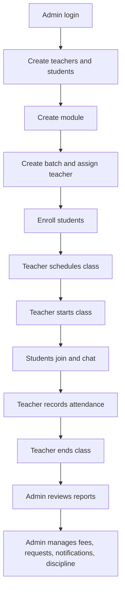

# EMTEES Academy LMS Project Report

## 1. Project Overview

EMTEES Academy LMS is a web-based learning management, communication, fee tracking, and academic operations platform for an academy or training institute. The system supports administrators, academic heads, teachers, and students through role-based dashboards and workflows.

The application combines:

- Student and staff account management
- Course module and batch management
- Group chat and announcements
- Live class scheduling with Jitsi meeting integration
- One-to-one session scheduling
- Attendance calculation based on chat engagement
- Fees and payment tracking
- Student and teacher reports
- Notifications and alerts
- Discipline and violation management

The project is built as a React frontend with a TypeScript/Hono/tRPC backend and PostgreSQL database access through Drizzle ORM.

## 2. Technology Stack

| Layer | Technology |
|---|---|
| Frontend | React 19, TypeScript, Vite |
| Styling | Tailwind CSS, shadcn-style UI components, Radix UI |
| Routing | React Router |
| API | tRPC, Hono, Hono Vite dev server |
| Backend language | TypeScript |
| Database ORM | Drizzle ORM |
| Database | PostgreSQL |
| Authentication | JWT using `jose`, password hashing using `bcryptjs` |
| Validation | Zod |
| State/data fetching | TanStack React Query through tRPC |
| Testing | Vitest, fast-check property tests |
| Video class support | Jitsi Meet component |

## 3. Project Structure

| Path | Purpose |
|---|---|
| `src/App.tsx` | Defines protected app routes and page mapping |
| `src/components/Layout.tsx` | Shared sidebar, header, mobile navigation, and role-based menu |
| `src/pages` | Main UI screens such as dashboard, users, batches, chat, classes, fees, reports, notifications, and discipline |
| `src/hooks/useAuth.tsx` | Authentication context, token storage, login/logout handling |
| `src/providers/trpc.tsx` | Frontend tRPC client provider |
| `api/router.ts` | Root backend router combining auth, user, learning, class, admin, and student routers |
| `api/routers` | Feature-specific API modules |
| `api/middleware.ts` | tRPC procedure setup and role authorization middleware |
| `api/lib/notificationEngine.ts` | Notification creation and bulk notification helpers |
| `db/schema.ts` | Database tables, enums, and TypeScript model types |
| `db/relations.ts` | Drizzle table relationship definitions |
| `db/seed.ts` | Initial super admin seed script |
| `tests` | Unit and property tests for core business rules |

## 4. User Roles and Access Control

The system defines five user roles:

| Role | Main Responsibilities |
|---|---|
| `super_admin` | Full platform access, user management, reports, discipline, notifications, fees |
| `admin` | Operational management of users, batches, payments, reports, notifications, and discipline |
| `academic_head` | Academic oversight with admin-level access |
| `teacher` | Class scheduling, class control, attendance recording, chat, materials, reports |
| `student` | View own batches, join classes, use chat, view fees, progress, alerts, and requests |

Authorization is enforced in `api/middleware.ts`:

- `publicQuery`: available without login
- `authedQuery`: requires valid JWT and session token
- `adminQuery`: allows `super_admin`, `admin`, and `academic_head`
- `teacherQuery`: allows admin roles and `teacher`

The layout also changes navigation based on role. Students see a smaller menu: Dashboard, Batches, Chat, Classes, Fees, Progress, and Alerts. Admin and teacher roles see the broader operational menu.

## 5. Main Functional Modules

### 5.1 Authentication

Implemented in `api/routers/auth.ts` and `src/pages/Login.tsx`.

Supported flows:

- Username and password login
- Student registration
- OTP login by phone number
- Auto-registration when a valid OTP is used for a new phone number
- Single-device session enforcement using a stored device token
- Account blocking for users with `suspended` or `on_hold` status

Seed login:

| Username | Password | Role |
|---|---|---|
| `admin` | `admin123` | `super_admin` |

### 5.2 User Management

Implemented in `api/routers/users.ts` and `src/pages/Users.tsx`.

Admin users can:

- List users by role, status, and search text
- Create students, teachers, admins, and academic heads
- Edit name, phone, email, status, course, batch, fees, and completion date
- Delete users
- Bulk import students from CSV-like pasted data
- Create student profiles alongside user records

Student profile data includes course, batch, fee totals, fee paid, fee balance, payment status, admission date, completion date, and activity timeline.

### 5.3 Modules and Batches

Implemented in `api/routers/learning.ts` and `src/pages/Batches.tsx`.

Admin users can:

- Create course modules
- Create batches under modules
- Assign teachers to batches
- Set batch time slots and capacity
- Enroll students in batches
- Remove students from batches

System rules:

- A student cannot be actively enrolled twice in the same batch.
- If active enrollment exceeds `maxStudents`, admins receive a capacity alert.
- If removing a student causes a batch to fall below the module's `minStudents`, admins receive an underpopulation alert.
- Course completion can auto-enroll a student into a community group batch if one exists.

### 5.4 Chat and Announcements

Implemented in `api/routers/learning.ts` and `src/pages/Chat.tsx`.

Features:

- Batch-wise chat
- Student, teacher, and admin access based on enrollment or assignment
- Message types: text, voice, image, video, PDF
- Replies using `replyToId`
- Reactions stored as JSON
- Teacher/admin announcements
- Message polling every three seconds in the UI
- Privacy rule: sender phone number is removed from chat results

Important business rule:

- Students with overdue payment status cannot send messages.
- Students cannot create announcements.

### 5.5 Classes and Live Sessions

Implemented in `api/routers/classes.ts` and `src/pages/Classes.tsx`.

Group class lifecycle:

1. Teacher or admin schedules a class for a batch.
2. Teacher starts the class.
3. System updates status to `ongoing`.
4. Active students in the batch receive a class-start notification.
5. Teacher and students join using the embedded Jitsi meeting room.
6. Teacher ends the class.
7. System marks it `completed`, stores end time, and calculates duration.

Class statuses:

- `scheduled`
- `ongoing`
- `completed`
- `cancelled`

### 5.6 One-to-One Sessions

Implemented in `api/routers/classes.ts`.

Admin users can schedule one-to-one sessions with:

- Teacher ID
- Student ID
- Session length
- Scheduled date/time
- Validity window of 60 days from scheduled date

Teachers can complete sessions only when the actual duration is within acceptable bounds:

| Planned Length | Accepted Actual Duration |
|---|---|
| 30 minutes | 25 to 40 minutes |
| 45 minutes | 35 to 60 minutes |
| Other | 80% to 150% of planned length |

Admin users can add or delete one-to-one session recordings.

### 5.7 Attendance

Implemented in `api/routers/classes.ts`.

Attendance is calculated from chat engagement:

| Chat Count | Attendance Status |
|---:|---|
| 0 to 3 | `absent` |
| 4 or more | `present` |

Additional rules:

- Attendance is unique per class and student.
- Updating attendance overwrites chat count and status.
- If a student has seven consecutive absences, the system sends alerts to the student, teacher, and admins.
- If gamification is enabled through `FEATURE_GAMIFICATION=true`, attendance streak badges are added to the student's activity timeline at 7 and 30 consecutive present records.

### 5.8 Fees and Payments

Implemented in `api/routers/admin.ts` and `src/pages/Fees.tsx`.

Admin users can:

- Create payment records
- Filter payments by status
- Record completed payments
- Store transaction IDs
- Reactivate inactive enrollments after payment
- Update profile fee totals

Student users can:

- View total fees
- View paid amount
- View balance
- View payment history

Fee calculation rule:

```text
feesBalance = feesTotal - feesPaid
```

### 5.9 Reports and Analytics

Implemented in `api/routers/admin.ts` and `src/pages/Reports.tsx`.

Dashboard stats include:

- Total students
- Total teachers
- Total batches
- Completed classes
- Pending unpaid fees

Student report includes:

- Attendance total
- Present count
- Attendance percentage
- Profile
- Payment list

Teacher report includes:

- Completed class count
- Student engagement rate based on chat count
- Student retention rate
- Course completion rate
- Performance label

Teacher performance labels:

| Completion Rate | Label |
|---:|---|
| 100% | `Best` |
| Less than 60% | `Needs Improvement` |
| 60% to 99% | `Average` |

Leaderboard logic:

```text
compositeScore = attendancePercentage + totalChatActivity
```

If `FEATURE_AI_INSIGHTS=true`, the system can flag:

- Students as at-risk when attendance is below 60%
- Teachers as needing improvement when completion rate is below 60%

### 5.10 Notifications

Implemented in `api/lib/notificationEngine.ts`, `api/routers/student.ts`, `api/routers/admin.ts`, and `src/pages/Notifications.tsx`.

Notifications are used for:

- Class start alerts
- Flexibility request decisions
- Absence alerts
- Batch capacity alerts
- Community group welcome messages
- Violation alerts
- Admin-created broadcasts

Students can mark their own notifications as read.

### 5.11 Discipline and Violations

Implemented in `api/routers/admin.ts` and `src/pages/Discipline.tsx`.

Admin users can:

- Record a violation against a user
- Notify the affected user
- Resolve violations
- Suspend users

Suspended users are blocked during login.

### 5.12 Flexibility Requests

Implemented in `api/routers/student.ts` and `api/routers/admin.ts`.

Students can request:

- Course hold
- Rejoin
- Batch change

Admins can approve or reject requests.

Approval effects:

- Hold: enrollment status becomes `on_hold`
- Rejoin: enrollment status becomes `active`
- Batch change: old enrollment becomes inactive and a new active enrollment is created

Every decision:

- Sends a student notification
- Updates admin note and resolver
- Appends an item to the student's activity timeline

## 6. Database Design Summary

### Core Identity Tables

| Table | Description |
|---|---|
| `users` | Main account table with role, status, login, phone, and profile identifiers |
| `profiles` | Student academic and fee profile data |
| `otp_codes` | OTP login codes with expiry and used status |

### Learning Tables

| Table | Description |
|---|---|
| `modules` | Course groups such as IELTS, PTE, Spoken English |
| `batches` | Subgroups under modules with teacher, time slot, and capacity |
| `batch_enrollments` | Student-to-batch membership |
| `learning_materials` | Study content attached to batches |
| `messages` | Batch chat messages |

### Class and Academic Tracking Tables

| Table | Description |
|---|---|
| `classes` | Group live class records |
| `one_to_one_sessions` | Individual class sessions |
| `attendance` | Per-student class attendance and chat count |
| `feedback` | Student feedback for teachers/classes |

### Operations Tables

| Table | Description |
|---|---|
| `payments` | Student fee payment records |
| `teacher_salaries` | Monthly salary calculations |
| `flexibility_requests` | Hold, rejoin, and batch change requests |
| `notifications` | User notification feed |
| `violations` | Discipline and conduct records |

## 7. End-to-End Workflow With Dummy Data

This section shows a realistic academy workflow using dummy records.

### 7.1 Dummy Users

| ID | Name | Role | Username | Phone | Status |
|---:|---|---|---|---|---|
| 1 | Admin | `super_admin` | `admin` | - | active |
| 2 | Priya Menon | `teacher` | `priya.teacher` | `9876500001` | active |
| 3 | Rahul Nair | `teacher` | `rahul.teacher` | `9876500002` | active |
| 4 | Ananya Das | `student` | `ananya` | `9876511111` | active |
| 5 | Vivek Kumar | `student` | `vivek` | `9876522222` | active |
| 6 | Sara Mathew | `student` | `sara` | `9876533333` | active |

### 7.2 Dummy Modules

| Module ID | Name | Description | Min Students | Max Students |
|---:|---|---|---:|---:|
| 1 | IELTS Foundation | IELTS listening, reading, writing, speaking basics | 5 | 50 |
| 2 | PTE Intensive | PTE academic test preparation | 5 | 40 |
| 3 | Spoken English | Spoken fluency and grammar | 5 | 60 |

### 7.3 Dummy Batches

| Batch ID | Module | Batch Name | Time Slot | Teacher | Max Students |
|---:|---|---|---|---|---:|
| 101 | IELTS Foundation | IELTS Morning A | 7:00 AM | Priya Menon | 30 |
| 102 | IELTS Foundation | IELTS Evening B | 6:00 PM | Rahul Nair | 30 |
| 201 | PTE Intensive | PTE Weekend | 10:00 AM | Priya Menon | 25 |

### 7.4 Dummy Student Profiles

| Student | Course | Batch | Fees Total | Fees Paid | Fees Balance | Payment Status |
|---|---|---|---:|---:|---:|---|
| Ananya Das | IELTS Foundation | IELTS Morning A | 15000 | 5000 | 10000 | partial |
| Vivek Kumar | IELTS Foundation | IELTS Morning A | 15000 | 15000 | 0 | paid |
| Sara Mathew | PTE Intensive | PTE Weekend | 18000 | 0 | 18000 | unpaid |

### 7.5 Workflow Step 1: Admin Creates Users

The admin logs in using:

```text
username: admin
password: admin123
```

Admin opens Users and creates:

- Teacher: Priya Menon
- Teacher: Rahul Nair
- Student: Ananya Das
- Student: Vivek Kumar
- Student: Sara Mathew

For students, the admin also enters course, batch, and total fee values. The backend creates rows in both `users` and `profiles`.

### 7.6 Workflow Step 2: Admin Creates Modules and Batches

Admin opens Batches and creates the IELTS Foundation module:

```json
{
  "name": "IELTS Foundation",
  "description": "IELTS listening, reading, writing, speaking basics",
  "minStudents": 5,
  "maxStudents": 50
}
```

Admin then creates a batch:

```json
{
  "moduleId": 1,
  "name": "IELTS Morning A",
  "timeSlot": "7:00 AM",
  "teacherId": 2,
  "maxStudents": 30
}
```

### 7.7 Workflow Step 3: Admin Enrolls Students

Admin enrolls Ananya and Vivek into IELTS Morning A:

```json
[
  { "batchId": 101, "studentId": 4 },
  { "batchId": 101, "studentId": 5 }
]
```

Expected result:

- Two active rows are created in `batch_enrollments`.
- Students can see the batch under My Batches.
- Students can access batch chat.

### 7.8 Workflow Step 4: Teacher Schedules a Class

Priya logs in and schedules:

```json
{
  "batchId": 101,
  "title": "IELTS Listening Practice - Section 1",
  "description": "Listening test format and question strategies",
  "classType": "group",
  "scheduledAt": "2026-06-05T07:00:00.000Z"
}
```

The class is created with status `scheduled`.

### 7.9 Workflow Step 5: Teacher Starts the Class

At class time, Priya clicks Start & Join.

System actions:

- Updates class status to `ongoing`
- Sets `startedAt`
- Creates a Jitsi room such as `emtees-ielts-listening-practice-section-1-301`
- Sends "Class Started" notifications to active enrolled students

### 7.10 Workflow Step 6: Students Chat During Class

Dummy messages:

| Sender | Message | Count Effect |
|---|---|---:|
| Priya | Good morning, please confirm audio. | Teacher message |
| Ananya | Audio is clear. | 1 |
| Ananya | I am ready. | 2 |
| Ananya | Answer is option B. | 3 |
| Ananya | Could you repeat question 4? | 4 |
| Vivek | Audio clear. | 1 |
| Vivek | My answer is C. | 2 |

Attendance result after teacher records attendance:

| Student | Chat Count | Status |
|---|---:|---|
| Ananya Das | 4 | present |
| Vivek Kumar | 2 | absent |

Reason:

```text
chatCount >= 4 means present
chatCount < 4 means absent
```

### 7.11 Workflow Step 7: Teacher Ends the Class

Priya clicks End Class.

System actions:

- Sets class status to `completed`
- Sets `endedAt`
- Calculates duration in minutes

Example:

```json
{
  "classId": 301,
  "status": "completed",
  "duration": 62
}
```

### 7.12 Workflow Step 8: Admin Records Payment

Admin creates payment record for Ananya:

```json
{
  "studentId": 4,
  "amount": 10000,
  "type": "tuition",
  "dueDate": "2026-06-10T00:00:00.000Z"
}
```

Later, admin records payment:

```json
{
  "paymentId": 501,
  "amount": 10000,
  "transactionId": "TXN-ANANYA-10000"
}
```

Expected fee profile after payment:

| Student | Fees Total | Previous Paid | New Payment | New Paid | Balance |
|---|---:|---:|---:|---:|---:|
| Ananya Das | 15000 | 5000 | 10000 | 15000 | 0 |

### 7.13 Workflow Step 9: Student Views Progress

Ananya opens Reports or Progress.

Example output:

```json
{
  "attendance": {
    "total": 1,
    "present": 1,
    "percentage": 100
  },
  "profile": {
    "course": "IELTS Foundation",
    "batch": "IELTS Morning A",
    "feesTotal": "15000",
    "feesPaid": "15000",
    "feesBalance": "0"
  }
}
```

### 7.14 Workflow Step 10: Teacher Report

Admin searches Priya's teacher ID.

Dummy result:

```json
{
  "totalClasses": 12,
  "studentEngagementRate": 18.75,
  "studentRetentionRate": 92,
  "courseCompletionRate": 80,
  "studentCompletionRate": 80,
  "performanceLabel": "Average"
}
```

### 7.15 Workflow Step 11: Flexibility Request

Vivek requests a batch change:

```json
{
  "requestType": "batch_change",
  "fromBatchId": 101,
  "toBatchId": 102,
  "reason": "Office timing changed"
}
```

Admin approves:

```json
{
  "requestId": 701,
  "status": "approved",
  "note": "Shifted to evening batch from next class"
}
```

System actions:

- Marks old enrollment inactive
- Creates active enrollment in new batch
- Sends notification to Vivek
- Appends request decision to Vivek's activity timeline

### 7.16 Workflow Step 12: Discipline Case

Admin records a violation:

```json
{
  "userId": 5,
  "type": "Chat Misuse",
  "description": "Repeated unrelated messages during live class",
  "action": "Warning issued"
}
```

System actions:

- Creates violation row
- Sends notification to the student
- Admin can later resolve the violation or suspend the user

## 8. Example API Workflow Summary



## 9. Key Business Rules

| Area | Rule |
|---|---|
| Authentication | Suspended and on-hold users cannot log in |
| Session control | Stored device token must match JWT session token |
| Users | Username and phone number must be unique |
| Batch enrollment | Duplicate active enrollment in same batch is blocked |
| Batch capacity | Over-capacity and under-minimum conditions trigger admin notifications |
| Chat | Only teachers/admins can create announcements |
| Chat | Overdue students cannot send messages |
| Attendance | `chatCount >= 4` is present; otherwise absent |
| Absence alert | Seven consecutive absences trigger notifications |
| Payment | Recorded payments update profile paid amount and balance |
| Salary | `total = groupClasses * groupRate + oneToOneSessions * oneToOneRate` |
| One-to-one session | Completion requires valid duration range |
| Reports | Teacher performance is based on student completion rate |
| Discipline | Suspended users are blocked from login |

## 10. Testing Summary

The project includes property-based tests for important business calculations:

| Test File | Purpose |
|---|---|
| `tests/unit/fees.unit.test.ts` | Verifies `feesBalance = feesTotal - feesPaid` |
| `tests/property/attendance.property.test.ts` | Verifies attendance threshold at chat count 4 |
| `tests/property/salary.property.test.ts` | Verifies salary calculation formula |

Recommended verification commands:

```bash
npm run check
npm run test
npm run build
```

## 11. Current Limitations and Improvement Opportunities

1. Some UI labels contain mojibake characters where rupee symbols or emoji appear, likely due to encoding issues.
2. Several admin forms ask for raw numeric IDs, such as student ID, teacher ID, and batch ID. Dropdown selectors would improve usability.
3. Chat attachment buttons are visible but file upload handling is not fully implemented in the current UI.
4. Report export currently returns structured JSON for client-side generation, not actual downloadable PDF or Excel files.
5. Teacher dashboard cards show placeholder values for classes and students.
6. Payment status on profiles is not fully synchronized in every payment path.
7. README still contains the default Vite template text and should be replaced with project-specific setup documentation.
8. `db/seed.ts` only creates the super admin. A richer demo seed would help showcase workflows quickly.

## 12. Recommended Demo Dataset

For a strong demo, seed the following:

- 1 super admin
- 1 academic head
- 2 teachers
- 6 students
- 3 modules
- 4 batches
- 10 enrollments
- 5 completed classes
- Attendance records with mixed chat counts
- 8 payments across paid, unpaid, partial, and overdue states
- 3 notifications
- 2 flexibility requests
- 1 violation
- 2 one-to-one sessions

This would allow all dashboards, reports, chat, fees, and discipline screens to show meaningful data immediately.

## 13. Conclusion

EMTEES Academy LMS is a role-based academy management platform with a practical feature set for online or hybrid coaching operations. Its strongest areas are the integrated flow between batches, live classes, chat, attendance, fees, notifications, and reporting. The system already has clear backend business rules and a functional frontend shell for the major workflows.

The next development priorities should be usability improvements, richer demo seeding, file upload support, real report export generation, and cleanup of encoding issues in visible UI text.
